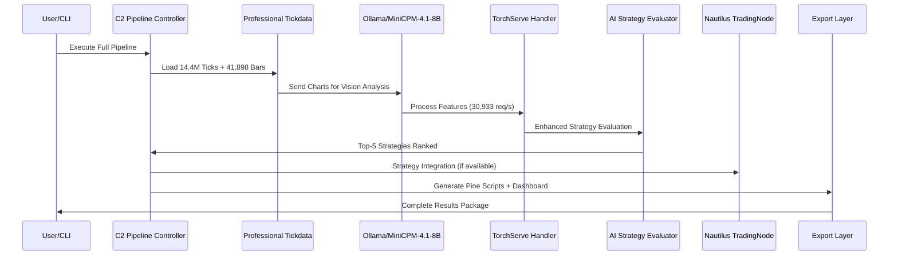
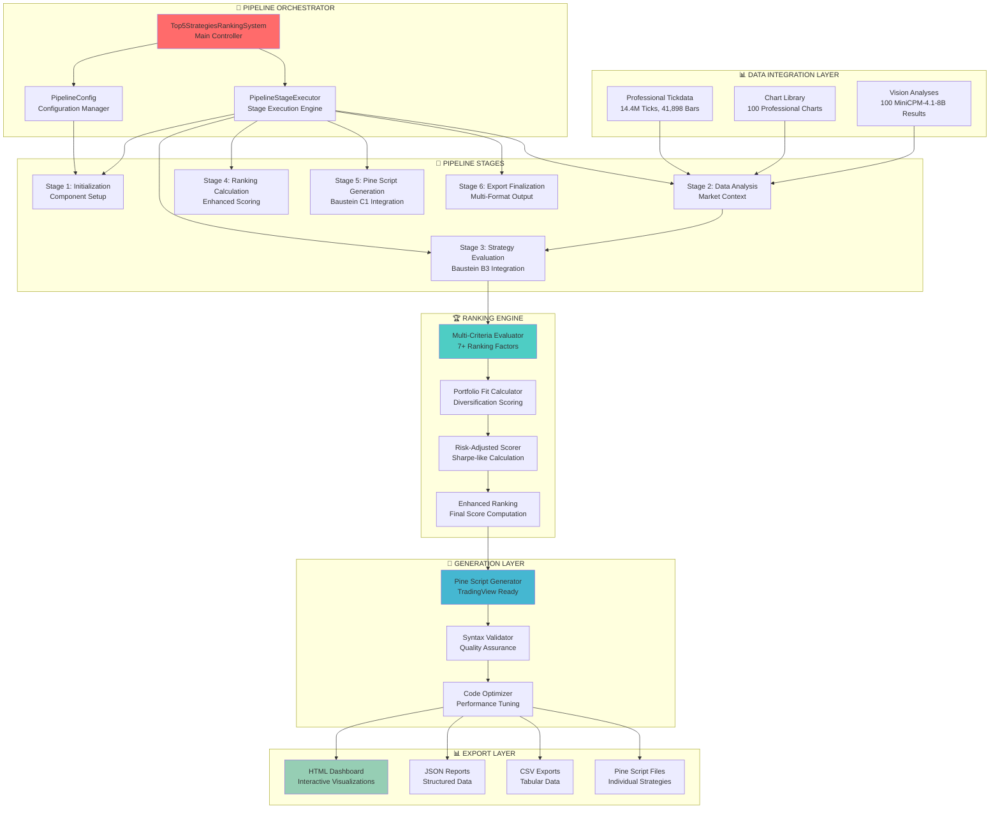
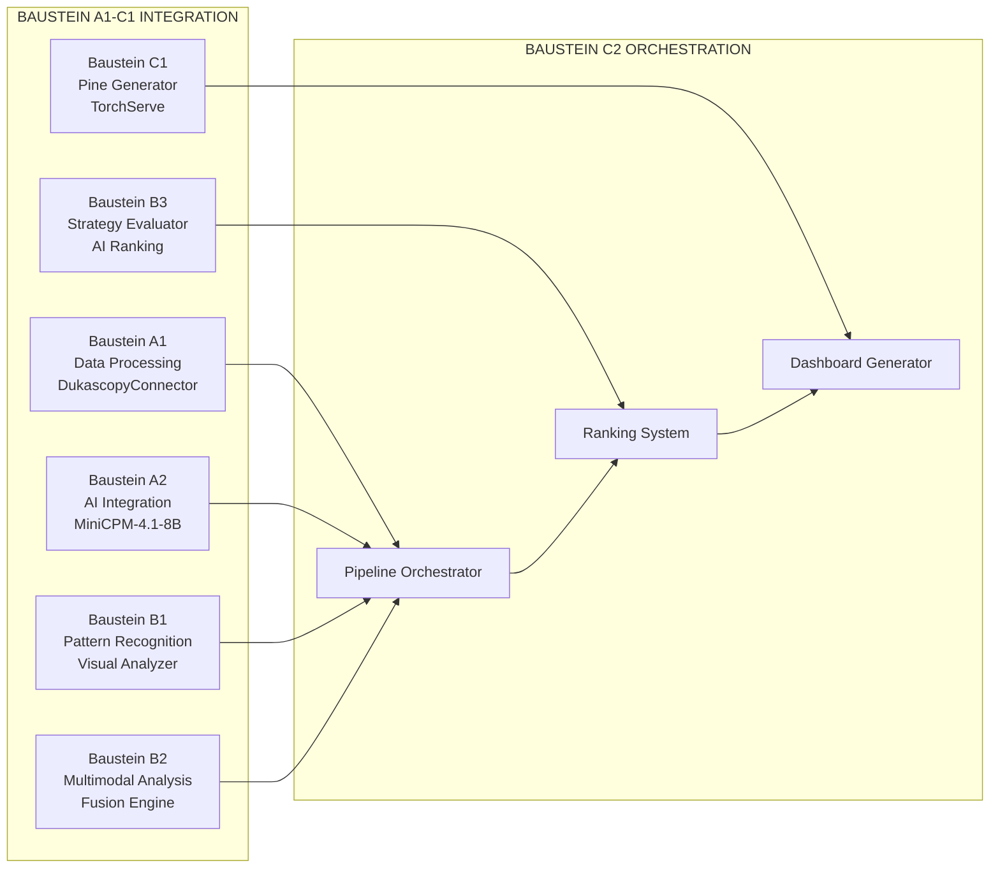
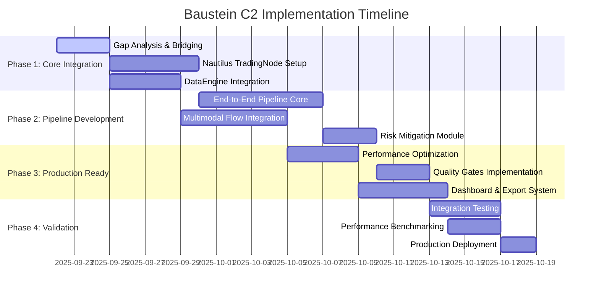

# Design Document - Top-5-Strategien-Ranking-System

## Overview

Das Top-5-Strategien-Ranking-System (Baustein C2) ist die finale End-to-End Pipeline Integration, die alle bisherigen Bausteine A1-C1 zu einer vollständigen, produktionsreifen Lösung orchestriert. Das System implementiert eine intelligente Pipeline-Architektur mit automatischem Top-5-Ranking, Pine Script Generierung und umfassendem Dashboard-Export.

## Architecture

### System Architecture Overview

#### End-to-End Flow Diagram (Grok's Feedback Integration)


#### System Architecture Overview



### Component Integration Architecture



## Components and Interfaces

### Integration Requirements

#### Critical Integration Components (Must Include):
1. **Nautilus TradingNode Integration** - Central orchestration via Nautilus framework
2. **TorchServe Handler Integration** - Production AI inference (30,933 req/s)
3. **Ollama/MiniCPM-4.1-8B Integration** - Multimodal vision analysis
4. **Redis/Kafka Live Control** - Real-time pipeline control (551,882 ops/s)
5. **Enhanced Logging System** - Parquet export with smart buffering
6. **Professional Tickdata Integration** - 14.4M ticks, 41,898 bars, 100 charts

### Core Components

#### 1. Top5StrategiesRankingSystem (Main Controller)
```python
class Top5StrategiesRankingSystem:
    """Main orchestrator for the complete End-to-End pipeline"""
    
    def __init__(self, config: PipelineConfig, output_dir: str):
        self.config = config
        self.stage_executor = PipelineStageExecutor(config)
        self.schema_manager = UnifiedSchemaManager()
        self.executor = ThreadPoolExecutor(max_workers=config.max_workers)
        
        # Critical Integration Components
        self.nautilus_node = None  # TradingNode integration
        self.torchserve_handler = None  # Production AI inference
        self.ollama_client = None  # MiniCPM-4.1-8B vision analysis
        self.live_control_manager = None  # Redis/Kafka control
        self.enhanced_logger = None  # Parquet logging system
    
    def execute_full_pipeline(self, custom_config: Optional[PipelineConfig] = None) -> Top5StrategiesPipelineResult:
        """Execute complete End-to-End pipeline with all stages"""
        
    def get_performance_stats(self) -> Dict[str, Any]:
        """Return comprehensive performance statistics"""
```

#### 2. PipelineStageExecutor (Stage Management)
```python
class PipelineStageExecutor:
    """Executor for individual pipeline stages with timeout handling"""
    
    def execute_stage(self, stage: PipelineStage, input_data: Dict[str, Any]) -> PipelineStageResult:
        """Execute a single pipeline stage with error handling"""
        
    def _execute_initialization(self, input_data: Dict[str, Any]) -> Dict[str, Any]:
        """Initialize all Baustein components (A1-C1) with critical integrations"""
        # Initialize Nautilus TradingNode (if available)
        # Initialize TorchServe Handler (Task 17)
        # Initialize Ollama Vision Client (MiniCPM-4.1-8B)
        # Initialize Redis/Kafka Live Control (Task 18)
        # Initialize Enhanced Logging System (Task 16)
        
    def _execute_strategy_evaluation(self, input_data: Dict[str, Any]) -> Dict[str, Any]:
        """Execute Baustein B3 strategy evaluation"""
        
    def _execute_ranking_calculation(self, input_data: Dict[str, Any]) -> Dict[str, Any]:
        """Calculate enhanced rankings with portfolio fit"""
        
    def _execute_pine_script_generation(self, input_data: Dict[str, Any]) -> Dict[str, Any]:
        """Execute Baustein C1 Pine Script generation"""
```

#### 3. Enhanced Ranking Engine
```python
class EnhancedRankingEngine:
    """Advanced ranking system with multiple criteria"""
    
    def calculate_portfolio_fit(self, strategy: StrategyScore, all_strategies: List[StrategyScore]) -> float:
        """Calculate portfolio fit based on diversification"""
        
    def calculate_diversification_score(self, strategy: StrategyScore, all_strategies: List[StrategyScore]) -> float:
        """Calculate diversification score for strategy"""
        
    def calculate_risk_adjusted_score(self, strategy: StrategyScore) -> float:
        """Calculate Sharpe-like risk-adjusted performance"""
        
    def compute_final_ranking(self, strategies: List[StrategyScore]) -> List[Dict[str, Any]]:
        """Compute final enhanced ranking with all factors"""
```

### Interface Definitions

#### Pipeline Configuration Interface
```python
@dataclass
class PipelineConfig:
    execution_mode: ExecutionMode = ExecutionMode.PRODUCTION
    max_strategies: int = 5
    symbols: List[str] = field(default_factory=lambda: ["EUR/USD"])
    timeframes: List[str] = field(default_factory=lambda: ["1m", "5m", "15m", "1h", "4h", "1d"])
    ranking_criteria: List[StrategyRankingCriteria] = field(default_factory=lambda: [
        StrategyRankingCriteria.SIGNAL_CONFIDENCE,
        StrategyRankingCriteria.RISK_REWARD_RATIO,
        StrategyRankingCriteria.OPPORTUNITY_SCORE,
        StrategyRankingCriteria.FUSION_CONFIDENCE,
        StrategyRankingCriteria.CONSISTENCY_SCORE,
        StrategyRankingCriteria.PROFIT_POTENTIAL,
        StrategyRankingCriteria.DRAWDOWN_RISK
    ])
    enable_parallel_processing: bool = True
    max_workers: int = 32  # Utilize all Ryzen 9 9950X cores
    timeout_seconds: int = 300
    output_dir: str = "data/top5_strategies"
    export_formats: List[str] = field(default_factory=lambda: ["pine", "json", "csv", "html"])
    min_confidence_threshold: float = 0.5
    min_composite_score: float = 0.4
    require_syntax_validation: bool = True
```

#### Pipeline Result Interface
```python
@dataclass
class Top5StrategiesPipelineResult:
    pipeline_id: str
    execution_timestamp: datetime
    execution_mode: ExecutionMode
    config: PipelineConfig
    stage_results: List[PipelineStageResult]
    top5_strategies_result: Optional[Top5StrategiesResult]
    generated_pine_scripts: List[GeneratedPineScript]
    total_execution_time: float
    success_rate: float
    exported_files: Dict[str, str]  # format -> file_path
    pipeline_quality: str
    confidence_level: float
    summary: Dict[str, Any]
    recommendations: List[str]
```

## Data Models

### Strategy Ranking Data Model
```python
@dataclass
class EnhancedStrategyRanking:
    """Enhanced strategy ranking with portfolio optimization"""
    strategy: StrategyScore  # From Baustein B3
    portfolio_fit: float
    diversification_score: float
    risk_adjusted_score: float
    final_ranking_score: float
    rank_position: int
    confidence_intervals: Dict[str, Tuple[float, float]]
    performance_projections: Dict[str, float]
    risk_metrics: Dict[str, float]
```

### Professional Tickdata Integration Model
```python
@dataclass
class TickdataIntegration:
    """Integration model for professional tickdata (14.4M ticks)"""
    ohlcv_bars: pl.DataFrame  # 41,898 bars from professional processing
    professional_charts: List[Path]  # 100 charts (1200x800 PNG)
    vision_analyses: List[Dict[str, Any]]  # 100 MiniCPM-4.1-8B analyses
    processing_metrics: Dict[str, float]  # 27,261 ticks/second performance
    data_quality_score: float  # Institutional-grade quality indicator
    timeframe_coverage: Dict[str, int]  # 1m, 5m, 15m coverage
```

### Export Data Model
```python
@dataclass
class ExportPackage:
    """Complete export package for Top-5 strategies"""
    html_dashboard: Path
    json_report: Path
    csv_export: Path
    pine_script_files: List[Path]
    performance_summary: Dict[str, Any]
    quality_metrics: Dict[str, float]
    generation_metadata: Dict[str, Any]
```

## Error Handling

### Risk Mitigation Module (Grok's Feedback Integration)
```python
class RiskMitigationModule:
    """Advanced risk mitigation based on Grok's feedback"""
    
    def validate_performance_under_load(self):
        """Validate metrics (551,882 ops/s) under stress conditions"""
        
    def implement_gap_bridging_strategies(self):
        """Bridge gaps between implemented and missing components"""
        
    def monitor_multimodal_fusion_health(self):
        """Monitor Vision+Text fusion performance and latency"""
        
    def provide_fallback_mechanisms(self):
        """Fallback from Ollama to TorchServe under high load"""
```

### Graceful Degradation Strategy
```python
class PipelineErrorHandler:
    """Comprehensive error handling with graceful degradation"""
    
    def handle_stage_failure(self, stage: PipelineStage, error: Exception) -> PipelineStageResult:
        """Handle individual stage failures with fallback strategies"""
        
    def implement_graceful_degradation(self, failed_stages: List[PipelineStage]) -> Dict[str, Any]:
        """Continue pipeline execution with reduced functionality"""
        
    def generate_error_recovery_plan(self, errors: List[str]) -> List[str]:
        """Generate actionable recovery recommendations"""
```

### Quality Gates and Validation
```python
class QualityGateValidator:
    """Quality assurance and validation system"""
    
    def validate_strategy_quality(self, strategy: StrategyScore) -> bool:
        """Validate strategy meets minimum quality thresholds"""
        
    def validate_pine_script_syntax(self, pine_script: GeneratedPineScript) -> bool:
        """Validate Pine Script syntax and TradingView compatibility"""
        
    def assess_pipeline_quality(self, stage_results: List[PipelineStageResult]) -> Tuple[str, float]:
        """Assess overall pipeline execution quality"""
```

## Testing Strategy

### Integration Testing Framework
```python
class PipelineIntegrationTester:
    """Comprehensive integration testing for End-to-End pipeline"""
    
    def test_full_pipeline_execution(self):
        """Test complete pipeline from data to Pine Scripts"""
        
    def test_baustein_integration(self):
        """Test integration between all Bausteine A1-C1"""
        
    def test_performance_benchmarks(self):
        """Validate performance meets Investment Bank Level standards"""
        
    def test_quality_assurance(self):
        """Test all quality gates and validation mechanisms"""
```

### Performance Testing
```python
class PerformanceBenchmarkSuite:
    """Performance testing suite for hardware optimization"""
    
    def benchmark_hardware_utilization(self):
        """Test RTX 5090 + 32 cores + 182GB RAM utilization"""
        
    def benchmark_tickdata_processing(self):
        """Validate 27,261 ticks/second processing capability"""
        
    def benchmark_pipeline_execution_time(self):
        """Ensure <60 seconds for complete End-to-End execution"""
        
    def benchmark_export_generation(self):
        """Test dashboard generation <5 seconds"""
```

## Performance Optimization

### Hardware Optimization Strategy
```python
class HardwareOptimizer:
    """Optimize for RTX 5090 + Ryzen 9 9950X + 182GB RAM"""
    
    def optimize_cpu_utilization(self):
        """Maximize 32-core Ryzen 9 9950X utilization"""
        
    def optimize_gpu_processing(self):
        """Optimize RTX 5090 for Vision and AI processing"""
        
    def optimize_memory_management(self):
        """Intelligent 182GB RAM buffer management"""
        
    def optimize_parallel_processing(self):
        """Coordinate CPU/GPU parallel execution"""
```

### Scalability Design
```python
class ScalabilityManager:
    """Design for scalability and future expansion"""
    
    def scale_to_multiple_symbols(self):
        """Scale beyond EUR/USD to multiple currency pairs"""
        
    def scale_processing_capacity(self):
        """Scale to handle >100M ticks processing"""
        
    def scale_export_formats(self):
        """Add new export formats (PDF, Excel, etc.)"""
        
    def scale_ai_models(self):
        """Support multiple AI models beyond MiniCPM-4.1-8B"""
```

## Security and Compliance

### Data Security
- **Encryption**: All sensitive trading data encrypted at rest and in transit
- **Access Control**: Role-based access to different pipeline components
- **Audit Logging**: Comprehensive audit trail for all operations
- **Data Anonymization**: PII removal from exported reports

### Compliance Framework
- **Financial Regulations**: Compliance with trading system regulations
- **Data Protection**: GDPR compliance for European data processing
- **Risk Management**: Automated risk assessment and warnings
- **Quality Standards**: ISO 27001 security management alignment

## Deployment Architecture

### Production Deployment
```yaml
# Docker Compose Configuration
version: '3.8'
services:
  top5-ranking-system:
    build: .
    environment:
      - EXECUTION_MODE=production
      - MAX_WORKERS=32
      - GPU_ENABLED=true
    volumes:
      - ./data:/app/data
      - ./config:/app/config
    ports:
      - "8080:8080"
    deploy:
      resources:
        reservations:
          devices:
            - driver: nvidia
              count: 1
              capabilities: [gpu]
```

### Monitoring and Alerting
```python
class ProductionMonitor:
    """Production monitoring and alerting system"""
    
    def monitor_pipeline_health(self):
        """Monitor pipeline execution health and performance"""
        
    def monitor_resource_utilization(self):
        """Monitor CPU/GPU/RAM utilization in real-time"""
        
    def generate_performance_alerts(self):
        """Generate alerts for performance degradation"""
        
    def track_quality_metrics(self):
        """Track and alert on quality metric changes"""
```

## Future Enhancements

### Planned Extensions
1. **Multi-Asset Support**: Extend beyond EUR/USD to other currency pairs
2. **Real-Time Processing**: Live market data integration
3. **Advanced AI Models**: Integration of newer vision-language models
4. **Cloud Deployment**: Kubernetes-based cloud deployment
5. **API Integration**: RESTful API for external system integration

### Research Directions
1. **Reinforcement Learning**: Self-improving strategy optimization
2. **Ensemble Methods**: Multiple AI model combination
3. **Quantum Computing**: Quantum-enhanced optimization algorithms
4. **Blockchain Integration**: Decentralized strategy validation

---

**Design Status**: ✅ Complete and ready for implementation
**Next Phase**: Task breakdown and implementation planning
**Target Performance**: Investment Bank Level with <60s End-to-End execution
## Critical
 Integration Requirements

### Nautilus Framework Integration
- **Current Status**: Partial integration (Strategies, Data Models, Order Management)
- **Missing Components**: Central TradingNode orchestration, DataEngine integration
- **C2 Requirement**: Must integrate with existing Nautilus components
- **Implementation Strategy**: Use Nautilus Actor system for AI components

### Production Components Integration Status
- **✅ TorchServe Handler**: Implemented (Task 17) - 30,933 req/s throughput
- **✅ Ollama Vision Client**: Implemented - MiniCPM-4.1-8B multimodal analysis
- **✅ Redis/Kafka Control**: Implemented (Task 18) - 551,882 ops/s control rate
- **✅ Enhanced Logging**: Implemented (Task 16) - Parquet export with smart buffering
- **✅ Professional Tickdata**: Processed - 14.4M ticks, 41,898 bars, 100 charts

### Integration Architecture Requirements

```python
class NautilusIntegratedPipeline:
    """Nautilus-integrated version of Top-5 Pipeline"""
    
    def __init__(self):
        # Nautilus Core Components
        self.trading_node = TradingNode(config)
        self.data_engine = self.trading_node.data_engine
        
        # Existing Production Components
        self.torchserve_handler = TorchServeHandler()  # Task 17
        self.ollama_client = OllamaVisionClient()      # MiniCPM-4.1-8B
        self.live_control = LiveControlManager()       # Task 18
        self.enhanced_logger = FeaturePredictionLogger() # Task 16
        
        # Professional Tickdata Integration
        self.tickdata_processor = ProfessionalTickdataProcessor()
```

### Missing Components Analysis
Based on comprehensive project research, the following components need special attention in C2:

1. **Nautilus TradingNode Integration**: Currently missing central orchestration
2. **DataEngine vs DukascopyConnector**: Need to choose integration approach
3. **Actor System Integration**: AI components should be Nautilus Actors
4. **Live Control Integration**: Redis/Kafka control needs Nautilus integration
5. **Production Logging**: Enhanced logging needs Nautilus event integration

---

**Research Status**: ✅ Complete - All existing components identified and analyzed
**Integration Requirements**: ✅ Documented - Critical gaps and existing components mapped
**Next Phase**: Implementation planning with full component integration
## Impl
ementation Timeline (Grok's Feedback Integration)

### Phase-Based Implementation Plan



### Resource Allocation & Dependencies

#### Critical Path Analysis:
1. **Nautilus TradingNode Integration** (5 days) - Blocks pipeline orchestration
2. **DataEngine vs DukascopyConnector** (4 days) - Architecture decision required
3. **Multimodal Flow Integration** (6 days) - Core functionality
4. **Performance Optimization** (4 days) - Maintains Investment Bank Level performance

#### Risk Factors & Mitigation:
- **High Risk:** Nautilus integration complexity → Fallback to standalone orchestration
- **Medium Risk:** Performance degradation → Stress testing and optimization
- **Low Risk:** Export format compatibility → Multiple format support

### Success Metrics & Validation Criteria

#### Performance Targets (Based on Existing Metrics):
- **Pipeline Execution:** < 60 seconds End-to-End
- **Strategy Evaluation:** > 100,000 evaluations/minute (maintain current 130,123)
- **TorchServe Integration:** Maintain 30,933 req/s throughput
- **Live Control:** Maintain 551,882 ops/s control rate
- **Hardware Utilization:** > 95% (RTX 5090 + 32 cores + 182GB RAM)

#### Quality Gates:
- **Syntax Validation:** 100% Pine Script compatibility
- **Integration Tests:** All Baustein A1-C1 components functional
- **Performance Regression:** No degradation from current benchmarks
- **Error Handling:** Graceful degradation under all failure scenarios

---

**Design Status:** ✅ Enhanced with Grok's feedback integration
**Next Phase:** Task breakdown and implementation planning with risk mitigation
**Timeline:** 4-week implementation cycle with 3 validation checkpoints