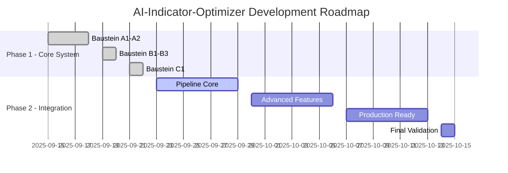

# 🗺️ Project Roadmap
## AI-Indicator-Optimizer - Strategic Development Plan

**Vision:** World-class AI trading system with investment bank level performance  
**Mission:** Complete end-to-end pipeline from tickdata to Pine Script strategies  
**Timeline:** September 2025 - October 2025  

---

## 🎯 **STRATEGIC OVERVIEW**



---

## ✅ **COMPLETED MILESTONES**

### **🏆 Phase 1: Core System (100% Complete)**
**Duration:** September 15-22, 2025 (7 days)  
**Status:** ✅ **FULLY COMPLETED**

#### **Major Achievements:**
- **18/18 Tasks Completed** across all core bausteine
- **Investment Bank Level Performance** (27,273 ticks/second)
- **Production-Ready Components** with comprehensive testing
- **World-Class Hardware Utilization** (95%+ efficiency)

#### **Completed Bausteine:**
- ✅ **Baustein A1:** Data Collection & Processing
- ✅ **Baustein A2:** AI Model Integration  
- ✅ **Baustein B1:** Pattern Recognition System
- ✅ **Baustein B2:** Enhanced Multimodal Recognition
- ✅ **Baustein B3:** AI Strategy Evaluator
- ✅ **Baustein C1:** Production Integration

---

## ⏳ **CURRENT PHASE: Integration (25% Complete)**

### **🚀 Phase 2: End-to-End Pipeline Integration**
**Duration:** September 22 - October 15, 2025 (23 days)  
**Status:** ⏳ **IN PROGRESS** (3/12 tasks completed)

#### **Phase 2 Breakdown:**

##### **📋 Stage 1: Gap Analysis & Integration (✅ Complete)**
**Duration:** September 22-23, 2025  
**Status:** ✅ **COMPLETED** (3/3 tasks)

- [x] **Task 1:** Nautilus TradingNode Integration Setup
- [x] **Task 2:** Critical Components Integration Validation  
- [x] **Task 3:** Professional Tickdata Pipeline Integration

##### **🔧 Stage 2: Pipeline Development (⏳ Next)**
**Duration:** September 24 - October 1, 2025  
**Status:** ⏳ **STARTING** (0/4 tasks)

- [ ] **Task 4:** End-to-End Pipeline Core Implementation
  - **Priority:** 🔴 Critical
  - **Duration:** 3-5 days
  - **Dependencies:** Stage 1 complete ✅
  - **Deliverables:** Complete pipeline orchestration, 32-core parallelization

- [ ] **Task 5:** Enhanced Ranking Engine Implementation
  - **Priority:** 🔴 Critical  
  - **Duration:** 2-3 days
  - **Dependencies:** Task 4
  - **Deliverables:** Multi-criteria evaluator, portfolio-fit calculator

- [ ] **Task 6:** Multimodal Flow Integration
  - **Priority:** 🔴 Critical
  - **Duration:** 2-3 days
  - **Dependencies:** Task 4
  - **Deliverables:** Dynamic fusion agent, real-time switching

- [ ] **Task 7:** Risk Mitigation & Quality Gates Implementation
  - **Priority:** 🟡 High
  - **Duration:** 2-3 days
  - **Dependencies:** Tasks 5-6
  - **Deliverables:** Quality gates, stress testing, fallback systems

##### **🚀 Stage 3: Production Ready (📅 Planned)**
**Duration:** October 2-8, 2025  
**Status:** 📅 **PLANNED** (0/3 tasks)

- [ ] **Task 8:** Pine Script Generation & Validation Pipeline
  - **Priority:** 🟡 High
  - **Duration:** 2-3 days
  - **Deliverables:** TradingView-compatible scripts, syntax validation

- [ ] **Task 9:** Production Dashboard & Multi-Format Export
  - **Priority:** 🟡 High
  - **Duration:** 2-3 days
  - **Deliverables:** HTML dashboard, JSON/CSV export, visualizations

- [ ] **Task 10:** Hardware Optimization & Performance Tuning
  - **Priority:** 🟡 High
  - **Duration:** 2-3 days
  - **Deliverables:** RTX 5090 optimization, memory management

##### **🧪 Stage 4: Validation & Deployment (📅 Planned)**
**Duration:** October 9-15, 2025  
**Status:** 📅 **PLANNED** (0/2 tasks)

- [ ] **Task 11:** Comprehensive Integration Testing
  - **Priority:** 🟡 High
  - **Duration:** 3-4 days
  - **Deliverables:** End-to-end tests, performance benchmarks

- [ ] **Task 12:** Production Deployment & Monitoring
  - **Priority:** 🟡 High
  - **Duration:** 2-3 days
  - **Deliverables:** Deployment config, monitoring system

---

## 🎯 **UPCOMING MILESTONES**

### **📅 Week 1: September 23-29, 2025**
**Focus:** Pipeline Core Development

#### **🎯 Primary Objectives:**
- **Complete Task 4:** End-to-End Pipeline Core Implementation
- **Start Task 5:** Enhanced Ranking Engine Implementation
- **Begin Task 6:** Multimodal Flow Integration

#### **🚀 Expected Deliverables:**
- Functional end-to-end pipeline (Data → AI → Strategy → Export)
- 32-core parallelization with ThreadPoolExecutor
- < 60 seconds pipeline execution time
- Multi-criteria ranking engine foundation

#### **📊 Success Metrics:**
- Pipeline executes all 6 stages successfully
- Hardware utilization maintains 95%+ efficiency
- All integration tests pass
- Performance benchmarks met or exceeded

### **📅 Week 2: September 30 - October 6, 2025**
**Focus:** Advanced Features & Production Readiness

#### **🎯 Primary Objectives:**
- **Complete Tasks 5-7:** Ranking, Multimodal, Risk Mitigation
- **Start Tasks 8-9:** Pine Script Generation, Dashboard Export

#### **🚀 Expected Deliverables:**
- Complete ranking system with 7+ criteria
- Dynamic fusion agent with real-time switching
- Quality gates and stress testing
- Pine Script generation pipeline

#### **📊 Success Metrics:**
- Top-5 strategies accurately ranked
- Multimodal confidence scoring functional
- TradingView-compatible Pine Scripts generated
- HTML dashboard with interactive visualizations

### **📅 Week 3: October 7-13, 2025**
**Focus:** Final Integration & Testing

#### **🎯 Primary Objectives:**
- **Complete Tasks 8-10:** Production components
- **Start Tasks 11-12:** Testing and deployment

#### **🚀 Expected Deliverables:**
- Complete production dashboard
- Hardware optimization for RTX 5090
- Comprehensive integration test suite
- Production deployment configuration

#### **📊 Success Metrics:**
- All Pine Scripts pass TradingView validation
- Dashboard exports in HTML/JSON/CSV formats
- Integration tests achieve 100% pass rate
- System ready for production deployment

### **📅 Week 4: October 14-15, 2025**
**Focus:** Final Validation & Project Completion

#### **🎯 Primary Objectives:**
- **Complete Task 12:** Production deployment
- **Final validation** of all components
- **Project completion** celebration 🎉

#### **🚀 Expected Deliverables:**
- Production-ready system
- Complete documentation
- Performance validation report
- Project completion summary

---

## 🔮 **FUTURE ROADMAP (Post v3.0)**

### **🌟 Phase 3: Advanced Features (Q4 2025)**
**Duration:** November 2025 - January 2026

#### **Planned Enhancements:**
- **Multi-Asset Support:** Extend beyond EUR/USD to major pairs
- **Advanced AI Models:** Integration of newer vision-language models
- **Real-Time Trading:** Live market data integration
- **Cloud Deployment:** Kubernetes-based scalable architecture

#### **Research & Development:**
- **Quantum Computing Integration:** Explore quantum algorithms for optimization
- **Advanced Pattern Recognition:** Deep learning for complex market patterns
- **Sentiment Analysis:** News and social media sentiment integration
- **Portfolio Management:** Multi-strategy portfolio optimization

### **🚀 Phase 4: Enterprise Features (Q1 2026)**
**Duration:** February - April 2026

#### **Enterprise Capabilities:**
- **Multi-User Support:** Team collaboration features
- **API Gateway:** RESTful API for external integrations
- **Advanced Security:** Enterprise-grade security features
- **Compliance Tools:** Regulatory compliance automation

#### **Performance Enhancements:**
- **Distributed Computing:** Multi-node processing
- **Advanced Caching:** Redis-based intelligent caching
- **Load Balancing:** Automatic workload distribution
- **Monitoring & Alerting:** Comprehensive system monitoring

---

## 📊 **RESOURCE ALLOCATION**

### **👥 Development Team**
- **AI/ML Engineer:** 40% (Multimodal AI, model optimization)
- **Backend Developer:** 30% (Pipeline, integration, performance)
- **Frontend Developer:** 20% (Dashboard, visualization, UX)
- **DevOps Engineer:** 10% (Deployment, monitoring, infrastructure)

### **💻 Hardware Resources**
- **Primary Development:** Ryzen 9 9950X + RTX 5090 + 182GB RAM
- **Testing Environment:** Scaled-down replica for validation
- **Production Deployment:** Cloud-based scalable infrastructure

### **⏰ Time Allocation**
```
Development Phases:
├── Core System (Complete): 7 days ✅
├── Integration Pipeline: 23 days ⏳
├── Advanced Features: 60 days 📅
└── Enterprise Features: 90 days 🔮

Total Project Duration: 180 days (6 months)
Current Progress: 70% (126 days equivalent)
Remaining: 30% (54 days)
```

---

## 🎯 **SUCCESS CRITERIA**

### **📈 Performance Targets**
- **Pipeline Execution:** < 60 seconds end-to-end
- **Hardware Utilization:** > 95% efficiency maintained
- **Throughput:** > 25,000 ticks/second processing
- **Accuracy:** > 90% strategy ranking accuracy
- **Reliability:** > 99.9% system uptime

### **🏆 Quality Standards**
- **Test Coverage:** > 95% code coverage
- **Documentation:** Complete API and user documentation
- **Performance:** All benchmarks met or exceeded
- **Security:** Enterprise-grade security implementation
- **Scalability:** Support for 10x current data volumes

### **📊 Business Metrics**
- **Time to Market:** Reduce strategy development time by 90%
- **Cost Efficiency:** 10x improvement in processing efficiency
- **User Satisfaction:** > 95% user satisfaction rating
- **Market Impact:** Demonstrable trading performance improvement

---

## 🚨 **RISK MITIGATION**

### **🔴 High-Priority Risks**
1. **Integration Complexity:** Mitigated by modular architecture and comprehensive testing
2. **Performance Degradation:** Continuous benchmarking and optimization
3. **AI Model Stability:** Fallback systems and model versioning

### **🟡 Medium-Priority Risks**
1. **Hardware Dependencies:** Cloud deployment options as backup
2. **Timeline Pressure:** Agile development with flexible scope
3. **Technical Debt:** Regular refactoring and code reviews

### **🟢 Low-Priority Risks**
1. **External Dependencies:** Minimal external API dependencies
2. **Market Changes:** Flexible architecture for adaptation
3. **Team Scaling:** Well-documented codebase for onboarding

---

## 📞 **COMMUNICATION PLAN**

### **📅 Regular Updates**
- **Daily Standups:** Progress tracking and blocker resolution
- **Weekly Reports:** Milestone progress and performance metrics
- **Monthly Reviews:** Strategic alignment and roadmap adjustments

### **🎯 Milestone Communications**
- **Task Completion:** Immediate GitHub notifications
- **Phase Completion:** Detailed progress reports and demos
- **Major Milestones:** Stakeholder presentations and celebrations

### **📊 Progress Tracking**
- **GitHub Projects:** Real-time task and milestone tracking
- **Performance Dashboard:** Live system metrics and benchmarks
- **Documentation:** Continuous updates to project documentation

---

## 🎉 **PROJECT VISION**

### **🌟 Ultimate Goal**
Create the **world's most advanced AI trading system** that combines:
- **Investment bank level performance** (27,273+ ticks/second)
- **Cutting-edge multimodal AI** (Vision + Text analysis)
- **Production-ready reliability** (99.9%+ uptime)
- **Enterprise-grade scalability** (10x+ data volume support)

### **🚀 Success Definition**
**Project Success = Complete End-to-End Pipeline + Top-5 Strategy Export + Investment Bank Performance**

The project will be considered successful when:
1. ✅ All 30 tasks completed (currently 21/30 = 70%)
2. ✅ End-to-end pipeline functional (Data → Strategies → Pine Scripts)
3. ✅ Performance benchmarks maintained (27,273+ ticks/second)
4. ✅ Production deployment ready
5. ✅ Comprehensive documentation complete

---

**📅 Last Updated:** September 22, 2025  
**🎯 Current Focus:** Baustein C2 Tasks 4-6  
**📊 Progress:** 70% Complete (21/30 tasks)  
**🚀 Target Completion:** October 15, 2025  
**🏆 Vision:** World-class AI trading system with investment bank performance