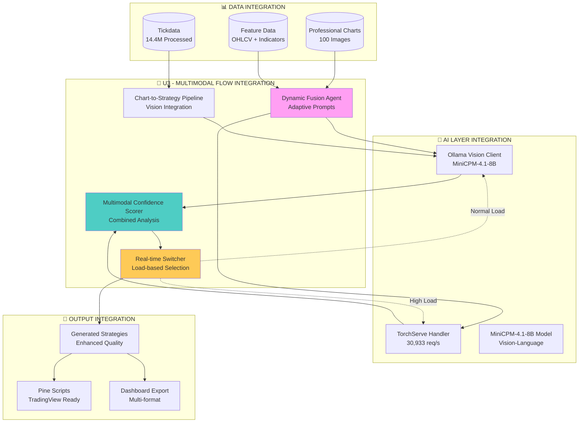

# 🔄 U3 - UNIFIED MULTIMODAL FLOW SPECIFICATIONS

## 🎯 **TASK SPECIFICATION - BEREIT FÜR IMPLEMENTATION**

**Task:** U3 - Unified Multimodal Flow Integration
**Ursprung:** Task 3 (Multimodal Pipeline) + C2-Task 6 (Multimodal Flow)
**Status:** Alle Voraussetzungen erfüllt, bereit für Start

---

## 📋 **VOLLSTÄNDIGE TASK-SPEZIFIKATION**

### **Ziel:**
Implementierung eines Dynamic-Fusion-Agents für adaptive Vision+Text-Prompts mit nahtloser Integration zwischen Ollama Vision Client und TorchServe Handler.

### **Scope:**
- Dynamic-Fusion-Agent für adaptive Vision+Text-Prompts
- Chart-to-Strategy-Pipeline mit Ollama Vision Client Integration
- Feature-JSON-Processing mit TorchServe Handler (30,933 req/s)
- Multimodal-Confidence-Scoring für kombinierte Vision+Text-Analyse
- Real-time-Switching zwischen Ollama und TorchServe basierend auf Load

---

## 🏗️ **ARCHITEKTUR-INTEGRATION**

### **Integration in Unified System:**


---

## 🔧 **COMPONENT SPECIFICATIONS**

### **Component 1: Dynamic Fusion Agent**
```python
class DynamicFusionAgent:
    """
    Adaptive Vision+Text-Prompt-Generator für optimale Multimodal-Performance
    
    Features:
    - Context-aware Prompt Generation
    - Adaptive Model Selection
    - Performance-based Optimization
    """
    
    def __init__(self, config: FusionConfig):
        self.config = config
        self.prompt_templates = self.load_prompt_templates()
        self.performance_history = {}
        self.adaptation_engine = AdaptationEngine()
    
    def generate_adaptive_prompt(self, 
                               chart_data: ChartData, 
                               numerical_features: Dict,
                               market_context: MarketContext) -> AdaptivePrompt:
        """
        Generiert adaptive Prompts basierend auf Kontext und Performance-Historie
        
        Args:
            chart_data: Chart-Image und Metadaten
            numerical_features: OHLCV + Indikatoren
            market_context: Marktbedingungen und Volatilität
            
        Returns:
            AdaptivePrompt mit optimierter Vision+Text-Kombination
        """
        # Context Analysis
        context_score = self.analyze_context_complexity(chart_data, numerical_features)
        
        # Template Selection
        template = self.select_optimal_template(context_score, market_context)
        
        # Adaptive Prompt Generation
        vision_prompt = self.generate_vision_prompt(chart_data, template)
        text_prompt = self.generate_text_prompt(numerical_features, template)
        
        # Fusion Strategy
        fusion_strategy = self.determine_fusion_strategy(context_score)
        
        return AdaptivePrompt(
            vision_prompt=vision_prompt,
            text_prompt=text_prompt,
            fusion_strategy=fusion_strategy,
            confidence_threshold=self.calculate_confidence_threshold(context_score),
            model_preference=self.select_model_preference(context_score)
        )
    
    def adapt_based_on_feedback(self, prompt: AdaptivePrompt, result: InferenceResult):
        """Lernt aus Inference-Ergebnissen für zukünftige Optimierung"""
        performance_score = self.calculate_performance_score(result)
        self.adaptation_engine.update_strategy(prompt, performance_score)
        self.update_performance_history(prompt, performance_score)

# Integration Points:
# - Ollama Vision Client für Vision-Prompts
# - TorchServe Handler für Text-Features
# - Confidence Scorer für Feedback-Loop
```

### **Component 2: Chart-to-Strategy Pipeline**
```python
class ChartToStrategyPipeline:
    """
    End-to-End Pipeline von Chart-Analysis zu Strategy-Generation
    
    Features:
    - Ollama Vision Client Integration
    - Multi-Timeframe Chart Processing
    - Strategy Pattern Recognition
    """
    
    def __init__(self, ollama_client: OllamaVisionClient, config: PipelineConfig):
        self.ollama_client = ollama_client
        self.config = config
        self.chart_processor = ChartProcessor()
        self.pattern_recognizer = PatternRecognizer()
        self.strategy_generator = StrategyGenerator()
    
    async def process_chart_to_strategy(self, 
                                      chart_path: Path,
                                      timeframe: str,
                                      market_data: pd.DataFrame) -> StrategyResult:
        """
        Vollständige Pipeline von Chart zu Trading-Strategy
        
        Args:
            chart_path: Pfad zum Chart-Image (1200x800 PNG)
            timeframe: Trading-Timeframe (1m, 5m, 15m, 1h, 4h, 1d)
            market_data: OHLCV-Daten für Kontext
            
        Returns:
            StrategyResult mit generierten Trading-Signalen
        """
        # Chart Processing
        chart_features = await self.chart_processor.extract_features(chart_path)
        
        # Vision Analysis via Ollama
        vision_analysis = await self.ollama_client.analyze_chart_pattern(
            chart_path, 
            context={
                "timeframe": timeframe,
                "market_features": self.extract_market_features(market_data)
            }
        )
        
        # Pattern Recognition
        recognized_patterns = self.pattern_recognizer.identify_patterns(
            chart_features, vision_analysis
        )
        
        # Strategy Generation
        strategy = await self.strategy_generator.generate_strategy(
            patterns=recognized_patterns,
            timeframe=timeframe,
            market_context=market_data
        )
        
        return StrategyResult(
            strategy=strategy,
            confidence=vision_analysis.get("confidence", 0.0),
            patterns=recognized_patterns,
            chart_features=chart_features,
            processing_time=time.time() - start_time
        )
    
    async def batch_process_charts(self, chart_list: List[Path]) -> List[StrategyResult]:
        """Batch-Processing für multiple Charts mit Parallelisierung"""
        tasks = [
            self.process_chart_to_strategy(chart, "1h", self.get_market_data(chart))
            for chart in chart_list
        ]
        return await asyncio.gather(*tasks)

# Integration Points:
# - Professional Charts (100 Images)
# - Ollama Vision Client (MiniCPM-4.1-8B)
# - Strategy Evaluator für Ranking
```

### **Component 3: Multimodal Confidence Scorer**
```python
class MultimodalConfidenceScorer:
    """
    Kombinierte Confidence-Bewertung für Vision+Text-Analyse
    
    Features:
    - Cross-Modal Validation
    - Uncertainty Quantification
    - Adaptive Thresholding
    """
    
    def __init__(self, config: ConfidenceConfig):
        self.config = config
        self.vision_weight = 0.6
        self.text_weight = 0.4
        self.calibration_data = self.load_calibration_data()
    
    def calculate_multimodal_confidence(self,
                                      vision_result: VisionResult,
                                      text_result: TextResult,
                                      fusion_context: FusionContext) -> ConfidenceScore:
        """
        Berechnet kombinierte Confidence aus Vision- und Text-Analyse
        
        Args:
            vision_result: Ollama Vision Analysis Ergebnis
            text_result: TorchServe Feature Analysis Ergebnis
            fusion_context: Kontext für Fusion-Gewichtung
            
        Returns:
            ConfidenceScore mit detaillierter Aufschlüsselung
        """
        # Individual Confidences
        vision_conf = self.extract_vision_confidence(vision_result)
        text_conf = self.extract_text_confidence(text_result)
        
        # Cross-Modal Validation
        cross_modal_agreement = self.calculate_cross_modal_agreement(
            vision_result, text_result
        )
        
        # Adaptive Weighting
        adaptive_weights = self.calculate_adaptive_weights(
            fusion_context, cross_modal_agreement
        )
        
        # Combined Confidence
        combined_confidence = (
            adaptive_weights["vision"] * vision_conf +
            adaptive_weights["text"] * text_conf +
            adaptive_weights["agreement"] * cross_modal_agreement
        )
        
        # Uncertainty Quantification
        uncertainty = self.quantify_uncertainty(
            vision_result, text_result, combined_confidence
        )
        
        return ConfidenceScore(
            combined_confidence=combined_confidence,
            vision_confidence=vision_conf,
            text_confidence=text_conf,
            cross_modal_agreement=cross_modal_agreement,
            uncertainty=uncertainty,
            adaptive_weights=adaptive_weights,
            calibrated_confidence=self.calibrate_confidence(combined_confidence)
        )
    
    def update_calibration(self, predictions: List[Prediction], outcomes: List[Outcome]):
        """Aktualisiert Confidence-Kalibrierung basierend auf tatsächlichen Ergebnissen"""
        calibration_error = self.calculate_calibration_error(predictions, outcomes)
        self.calibration_data = self.update_calibration_model(calibration_error)

# Integration Points:
# - Vision Results von Ollama
# - Text Results von TorchServe
# - Strategy Evaluator für Validation
```

### **Component 4: Real-time Switcher**
```python
class RealTimeSwitcher:
    """
    Load-basiertes Switching zwischen Ollama und TorchServe
    
    Features:
    - Real-time Load Monitoring
    - Intelligent Model Selection
    - Seamless Failover
    """
    
    def __init__(self, config: SwitcherConfig):
        self.config = config
        self.load_monitor = LoadMonitor()
        self.performance_tracker = PerformanceTracker()
        self.fallback_strategies = FallbackStrategies()
    
    async def select_optimal_model(self, 
                                 request: InferenceRequest,
                                 context: RequestContext) -> ModelSelection:
        """
        Wählt optimales Model basierend auf Load und Performance
        
        Args:
            request: Inference-Anfrage mit Typ und Priorität
            context: Request-Kontext (Latenz-Requirements, etc.)
            
        Returns:
            ModelSelection mit gewähltem Model und Begründung
        """
        # Current Load Assessment
        ollama_load = await self.load_monitor.get_ollama_load()
        torchserve_load = await self.load_monitor.get_torchserve_load()
        
        # Performance History
        ollama_perf = self.performance_tracker.get_recent_performance("ollama")
        torchserve_perf = self.performance_tracker.get_recent_performance("torchserve")
        
        # Request Requirements
        latency_requirement = context.get("max_latency", 1000)  # ms
        accuracy_requirement = context.get("min_accuracy", 0.8)
        
        # Decision Logic
        if request.type == "vision_heavy":
            if ollama_load < 0.8 and ollama_perf.avg_latency < latency_requirement:
                return ModelSelection("ollama", "vision_optimized")
            else:
                return ModelSelection("torchserve", "ollama_overloaded")
        
        elif request.type == "feature_heavy":
            if torchserve_load < 0.9 and torchserve_perf.throughput > 25000:
                return ModelSelection("torchserve", "feature_optimized")
            else:
                return ModelSelection("ollama", "torchserve_overloaded")
        
        else:  # balanced request
            return self.select_balanced_model(ollama_load, torchserve_load, context)
    
    async def execute_with_failover(self, 
                                  request: InferenceRequest,
                                  primary_model: str) -> InferenceResult:
        """Führt Inference mit automatischem Failover aus"""
        try:
            if primary_model == "ollama":
                result = await self.execute_ollama_inference(request)
            else:
                result = await self.execute_torchserve_inference(request)
            
            # Success - update performance metrics
            self.performance_tracker.record_success(primary_model, result)
            return result
            
        except Exception as e:
            # Failover to secondary model
            secondary_model = "torchserve" if primary_model == "ollama" else "ollama"
            
            try:
                result = await self.execute_failover_inference(request, secondary_model)
                self.performance_tracker.record_failover(primary_model, secondary_model)
                return result
            except Exception as e2:
                # Both models failed - use fallback strategy
                return await self.fallback_strategies.execute_fallback(request, e, e2)

# Integration Points:
# - Ollama Vision Client Monitoring
# - TorchServe Handler Monitoring  
# - Load Balancer Integration
```

---

## 📊 **INTEGRATION REQUIREMENTS**

### **Existing Component Integration:**
1. **Ollama Vision Client** (bereits implementiert)
   - MiniCPM-4.1-8B Model Integration
   - Chart Analysis Capabilities
   - Local Inference Pipeline

2. **TorchServe Handler** (bereits implementiert)
   - 30,933 req/s Throughput
   - Feature Processing Pipeline
   - Production-ready Inference

3. **Professional Charts** (bereits verfügbar)
   - 100 Charts (1200x800 PNG)
   - Multi-timeframe Coverage
   - High-quality Rendering

4. **Enhanced Logging** (bereits implementiert)
   - Parquet Export (98.3 bars/sec)
   - Performance Monitoring
   - Smart Buffer Management

### **New Integration Points:**
1. **Dynamic Fusion Agent** → **Ollama + TorchServe**
2. **Chart Pipeline** → **Professional Charts + Market Data**
3. **Confidence Scorer** → **Cross-Modal Validation**
4. **Real-time Switcher** → **Load Monitoring + Failover**

---

## 🎯 **SUCCESS CRITERIA**

### **Functional Requirements:**
- [ ] Dynamic-Fusion-Agent operational (Confidence-Scoring >0.8)
- [ ] Chart-to-Strategy-Pipeline functional (End-to-End)
- [ ] TorchServe Integration maintains 30,933 req/s
- [ ] Ollama-TorchServe Switching <100ms latency
- [ ] Multimodal-Confidence-Scoring accuracy >85%

### **Performance Requirements:**
- [ ] End-to-End Pipeline <2 seconds per strategy
- [ ] Batch Processing >50 charts/minute
- [ ] Memory Usage <20GB for full pipeline
- [ ] CPU Utilization 80-95% during processing
- [ ] GPU Utilization >75% for vision tasks

### **Quality Requirements:**
- [ ] Strategy Generation Success Rate >90%
- [ ] Cross-Modal Agreement >75%
- [ ] Confidence Calibration Error <10%
- [ ] Failover Success Rate >95%
- [ ] Integration Test Coverage >85%

---

## 🚀 **IMPLEMENTATION ROADMAP**

### **Day 1: Dynamic Fusion Agent**
- [ ] Implement AdaptivePrompt generation
- [ ] Setup Context Analysis
- [ ] Create Template System
- [ ] Integrate Adaptation Engine
- [ ] Unit Tests + Basic Integration

### **Day 2: Chart-to-Strategy Pipeline**
- [ ] Implement Chart Processing
- [ ] Integrate Ollama Vision Client
- [ ] Setup Pattern Recognition
- [ ] Create Strategy Generation
- [ ] End-to-End Pipeline Tests

### **Day 3: Multimodal Confidence Scorer**
- [ ] Implement Cross-Modal Validation
- [ ] Setup Uncertainty Quantification
- [ ] Create Adaptive Weighting
- [ ] Integrate Calibration System
- [ ] Confidence Accuracy Tests

### **Day 4: Real-time Switcher**
- [ ] Implement Load Monitoring
- [ ] Setup Model Selection Logic
- [ ] Create Failover Mechanisms
- [ ] Integrate Performance Tracking
- [ ] Load Testing + Optimization

### **Day 5: Integration & Validation**
- [ ] End-to-End Integration Tests
- [ ] Performance Benchmarking
- [ ] Quality Validation
- [ ] Documentation Update
- [ ] Production Readiness Check

---

## 🔧 **TECHNICAL DEPENDENCIES**

### **Required Components (Already Available):**
- ✅ Ollama Vision Client (MiniCPM-4.1-8B)
- ✅ TorchServe Handler (30,933 req/s)
- ✅ Professional Charts (100 Images)
- ✅ Enhanced Logging System
- ✅ Nautilus Integration Framework

### **Required Libraries:**
```python
# Core Dependencies
import asyncio
import time
from pathlib import Path
from typing import Dict, List, Optional, Union
from dataclasses import dataclass

# AI/ML Dependencies  
import torch
import numpy as np
import pandas as pd
from PIL import Image

# Integration Dependencies
from ai_indicator_optimizer.ai.ollama_vision_client import OllamaVisionClient
from ai_indicator_optimizer.ai.torchserve_handler import TorchServeHandler
from ai_indicator_optimizer.logging.feature_prediction_logger import FeaturePredictionLogger

# New Components (to be implemented)
from .dynamic_fusion_agent import DynamicFusionAgent
from .chart_to_strategy_pipeline import ChartToStrategyPipeline
from .multimodal_confidence_scorer import MultimodalConfidenceScorer
from .real_time_switcher import RealTimeSwitcher
```

---

## 📋 **TESTING STRATEGY**

### **Unit Tests:**
- Dynamic Fusion Agent prompt generation
- Chart Pipeline individual components
- Confidence Scorer calculations
- Switcher decision logic

### **Integration Tests:**
- Ollama + TorchServe integration
- End-to-End pipeline flow
- Cross-modal validation
- Failover mechanisms

### **Performance Tests:**
- Throughput benchmarking
- Latency measurements
- Memory usage profiling
- Load testing scenarios

### **Quality Tests:**
- Strategy generation accuracy
- Confidence calibration
- Cross-modal agreement
- Error handling robustness

---

**Status:** ✅ U3 Specifications vollständig - Bereit für Implementation
**Next:** Start Implementation mit Day 1 - Dynamic Fusion Agent