# 🏗️ UNIFIED SYSTEM ARCHITECTURE - Grok's Design-Synchronisation

## 📊 **DESIGN-INKONSISTENZEN GELÖST**

**Problem:** README1.md (modular) vs. layer.png (linear) Architektur-Konflikte
**Lösung:** Unified Hybrid-Architektur mit interaktiven Switches

---

## 🎯 **UNIFIED HYBRID ARCHITECTURE**

```mermaid
graph TB
    subgraph "🎯 CONTROL ORCHESTRATOR"
        CLI[Main CLI Application]
        CONFIG[Configuration Manager]
        NAUTILUS[Nautilus TradingNode<br/>🔄 Central Orchestration]
    end

    subgraph "📊 DATA LAYER - BAUSTEIN A1"
        DUKA[Dukascopy Connector<br/>14.4M Ticks Processing]
        PROC[Multimodal Data Processor<br/>Charts + Indicators]
        VALID[Data Validator<br/>Integrity Checks]
        TICKDATA[(Professional Tickdata<br/>41,898 OHLCV Bars)]
    end

    subgraph "🧠 AI LAYER - BAUSTEIN A2"
        MINICPM[MiniCPM-4.1-8B<br/>Vision-Language Model]
        OLLAMA[Ollama Integration<br/>Local Inference]
        FUSION[Multimodal Fusion Engine<br/>Vision + Text]
        TORCH[TorchServe Handler<br/>30,933 req/s]
    end

    subgraph "🔍 PATTERN LAYER - BAUSTEIN B1"
        VISUAL[Visual Pattern Analyzer<br/>Chart Recognition]
        HIST[Historical Pattern Miner<br/>Auto-Discovery]
        LIB[Pattern Library<br/>30GB Cache]
        CHARTS[(Chart Library<br/>100 Professional Charts)]
    end

    subgraph "⚡ GENERATION LAYER - BAUSTEIN B2"
        PINE[Pine Script Generator<br/>TradingView Ready]
        VALID_PINE[Pine Script Validator<br/>Syntax Checking]
        EVAL[AI Strategy Evaluator<br/>Multi-Criteria Ranking]
    end

    subgraph "🏆 RANKING LAYER - BAUSTEIN B3"
        RANK[Top-5 Ranking System<br/>Portfolio Optimization]
        CONF[Confidence Scorer<br/>Risk Assessment]
        ENHANCED[Enhanced Ranking Engine<br/>C2 Integration]
    end

    subgraph "🚀 PRODUCTION LAYER - BAUSTEIN C1"
        LIVE[Live Control Manager<br/>Redis/Kafka - 551,882 ops/s]
        LOG[Enhanced Logging<br/>Parquet Export - 98.3 bars/sec]
        ENV[Environment Manager<br/>Multi-Config]
    end

    subgraph "🔄 C2 INTEGRATION LAYER"
        PIPELINE[Top5 Pipeline Controller<br/>End-to-End Orchestration]
        MULTIMODAL[Multimodal Flow Integration<br/>Task 6 - Dynamic Fusion]
        DASHBOARD[Production Dashboard<br/>HTML/JSON/CSV Export]
    end

    %% LINEAR FLOW (layer.png Integration)
    CLI --> NAUTILUS
    NAUTILUS --> DUKA
    DUKA --> TICKDATA
    TICKDATA --> PROC
    PROC --> MINICPM
    MINICPM --> OLLAMA
    OLLAMA --> FUSION
    FUSION --> TORCH
    TORCH --> VISUAL
    VISUAL --> HIST
    HIST --> LIB
    LIB --> CHARTS
    CHARTS --> PINE
    PINE --> EVAL
    EVAL --> RANK
    RANK --> ENHANCED
    ENHANCED --> PIPELINE
    PIPELINE --> MULTIMODAL
    MULTIMODAL --> DASHBOARD
    DASHBOARD --> LIVE
    LIVE --> LOG

    %% MODULAR CONNECTIONS (README1.md Integration)
    CONFIG --> NAUTILUS
    VALID --> PROC
    FUSION --> VISUAL
    CONF --> ENHANCED
    ENV --> LOG

    %% INTERACTIVE SWITCHES
    OLLAMA -.->|High Load Switch| TORCH
    DUKA -.->|Fallback Mode| VALID
    PINE -.->|Quality Gate| VALID_PINE
    RANK -.->|C2 Enhancement| ENHANCED

    style CLI fill:#ff6b6b
    style NAUTILUS fill:#e74c3c
    style MINICPM fill:#4ecdc4
    style FUSION fill:#45b7d1
    style EVAL fill:#96ceb4
    style PIPELINE fill:#feca57
    style MULTIMODAL fill:#ff9ff3
```



---

## 🔄 **INTERACTIVE FLOW MODES**

### **Mode 1: Linear Production Flow (layer.png)**
```
Tickdata → OHLCV → Charts → Vision → Fusion → Strategy → Production
```

### **Mode 2: Modular Development Flow (README1.md)**
```
Data Layer ↔ AI Layer ↔ Pattern Layer ↔ Generation Layer ↔ Production Layer
```

### **Mode 3: Hybrid C2 Flow (Unified)**
```
Nautilus Orchestration → Multimodal Processing → Enhanced Ranking → Dashboard Export
```

---

## 📋 **TASK-INTEGRATION MAPPING**

| Layer | Haupt-Tasks | C2-Tasks | Integration |
|-------|-------------|----------|-------------|
| **Data** | Tasks 1-4 | Tasks 1-3 | ✅ Nautilus Integration |
| **AI** | Tasks 5-6 | Task 6 | 🔄 Multimodal Flow |
| **Pattern** | Tasks 7-8 | Tasks 4-5 | ✅ Enhanced Ranking |
| **Generation** | Tasks 9-10 | Tasks 8-9 | ✅ Pine Script Pipeline |
| **Production** | Tasks 11-18 | Tasks 10-12 | ✅ Dashboard Export |

---

## 🎯 **PERFORMANCE INTEGRATION**

| Metric | Current Value | Validation Status | Integration Point |
|--------|---------------|-------------------|-------------------|
| **Tick Processing** | 27,261 Ticks/s | ✅ Validated | Dukascopy → OHLCV |
| **TorchServe Throughput** | 30,933 req/s | ✅ Validated | AI Layer → Generation |
| **Live Control Rate** | 551,882 ops/s | ✅ Validated | Production Layer |
| **Feature Processing** | 98.3 bars/sec | ✅ Validated | Logging Pipeline |

---

## 🔧 **SWITCH MECHANISMS**

### **High-Load Switching**
```python
if load > threshold:
    switch_ollama_to_torchserve()
    
if api_limit_reached:
    activate_fallback_mode()
    
if quality_gate_failed:
    trigger_validation_pipeline()
```

### **Nautilus Integration Points**
```python
# Central Orchestration
trading_node.orchestrate_ai_services()

# Data Engine Integration  
data_engine.integrate_dukascopy_connector()

# Actor System for AI Services
actor_system.deploy_ai_components()
```

---

**Status:** ✅ Design-Inkonsistenzen gelöst durch Unified Hybrid Architecture
**Next:** Task-Matrix für Duplikations-Analyse